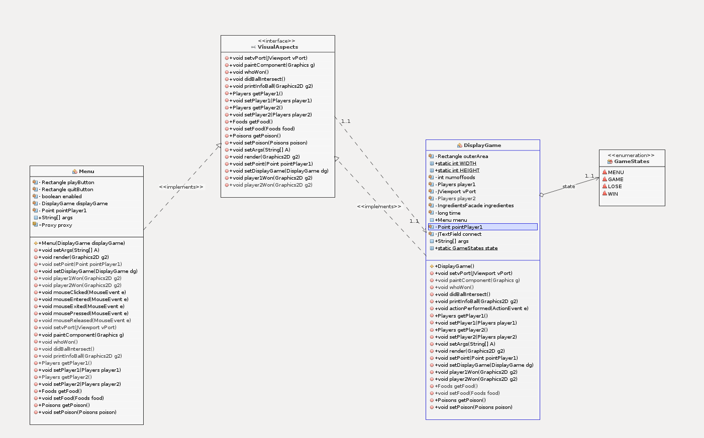
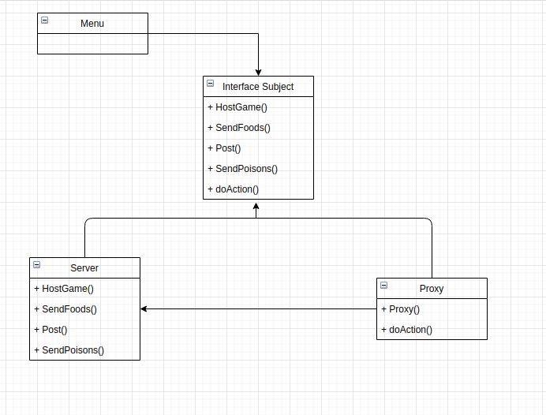
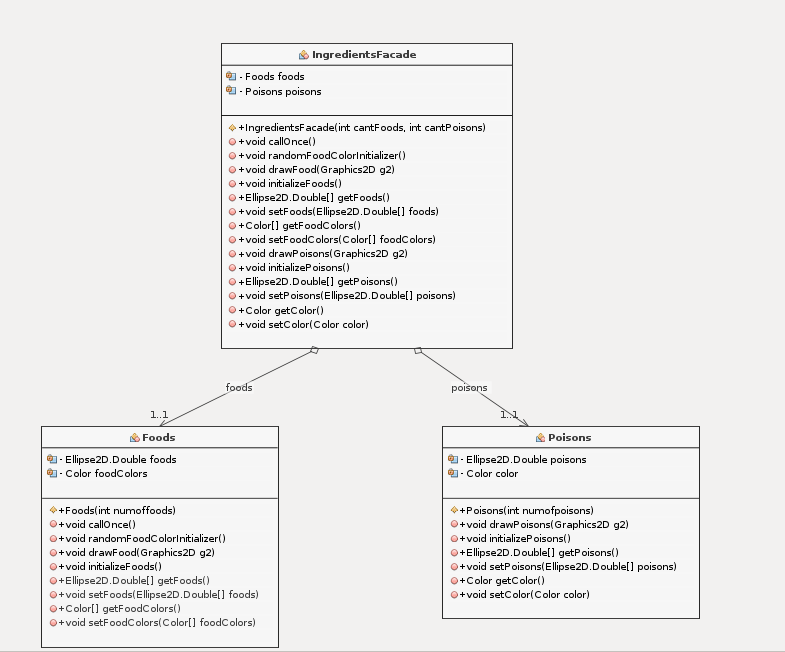

# Juego Agario

Se aplicaron los siguientes patrones de desarrollo:

# Abstract Factory :

Utilizamos este patron de tipo creacion para generar una abstraccion de las clases Menu y DisplayGame de tal manera que la interface VisualEfects permite crear una instacia de ellas sin que estas sean utilizadas.

# Proxy:

Utilizamos el patron proxy de tipo estructural, para generar una instancia de la clase server, y la interface Subject nos permite controlar el acceso a esta.

# Facade :

Como patron estructural facade, nos permite proporcionar una interfaz (IngredientsFacade) de acceso unificada para las clases de Foods y Poisons, proporciuonando una interfaz de alto nivel haciendo mas facil el uso de estas clases.

